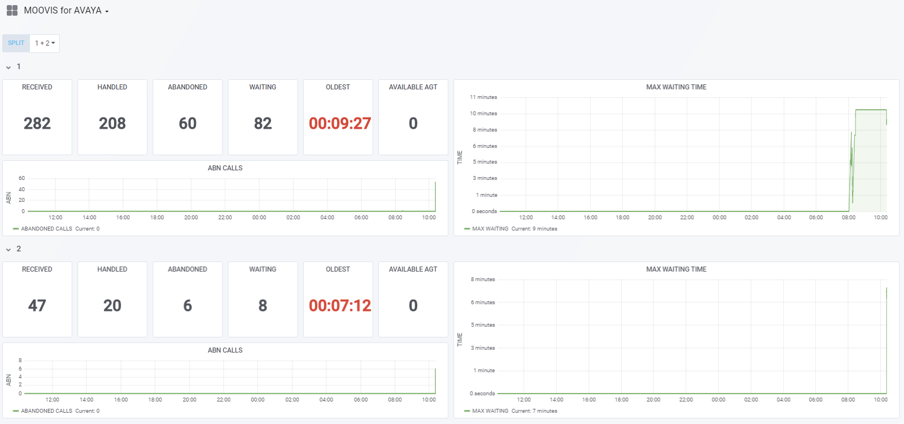
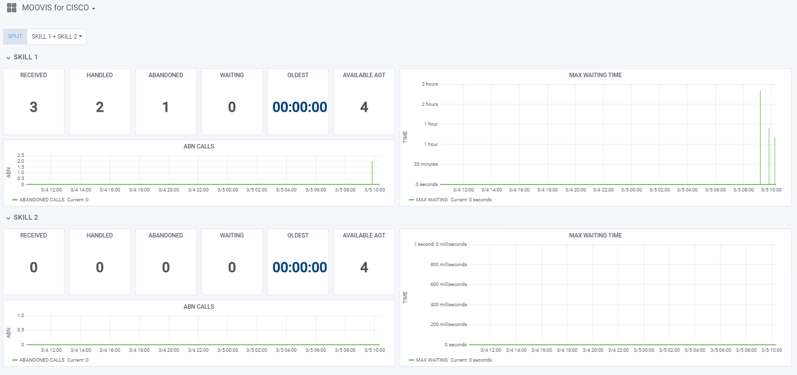
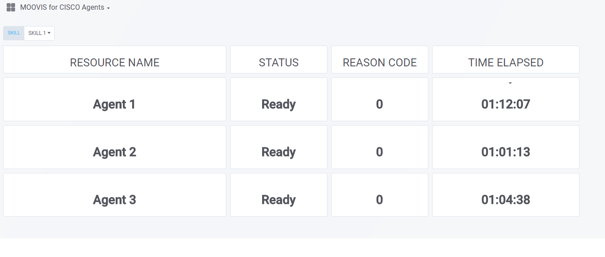

# MOOVIS: Contact Center Wallboard 

**MOOVIS** is a set of microservices collecting data from CISCO UCCX, AVAYA RT Socket & EPTICA Supervision.

## Default Dashboards:

**MOOVIS for AVAYA**



**MOOVIS for Cisco UCCX CSQs**



**MOOVIS for Cisco UCCX Agents**



## Dependencies

* [Lagom Zookeeper Service Locator](https://github.com/jboner/lagom-service-locator-zookeeper)

## Building services & publish locally

```bash
#build moovis services and publish locally
sbt -DbuildTarget=docker clean docker:publishLocal
#build grafana for moovis
./docker/build.sh
```

## Deploy

Deploy services with docker compose
```bash
docker stack deploy --compose-file docker/docker-compose.yml moovis
```

## TODO

Asterisk Collector!

## License
Copyright (C) 2018 DIGIGLADD 

Yohann BARRE [](https://www.linkedin.com/in/yohann-barre-5b6a9317).

MOOVIS is distributed under Apache 2.0 License.